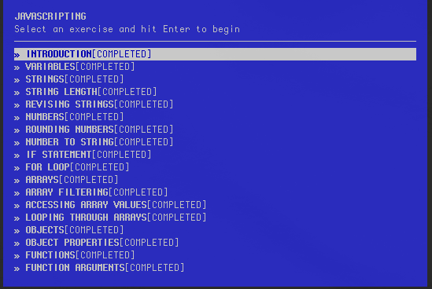

## javascripting

> Some basic exercises for Javascript.

> I have fun when doing it. <3

- Introduction
- Variables
- Strings
- String Length
- Revising Strings
- Numbers
- Rounding Numbers
- Number to String
- For Loop
- Arrays
- Array Filtering
- Accessing Array Values
- Looping Through Arrays
- Objects
- Object Properties
- Functions
- Function Arguments

